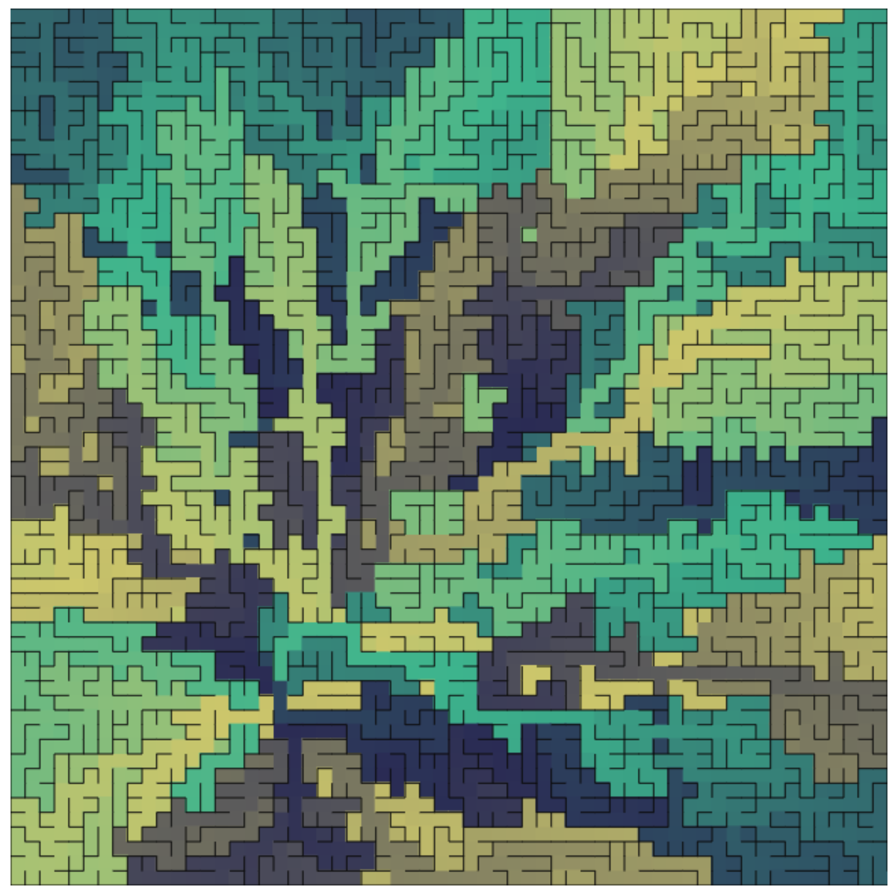

# maze
A maze generating and rendering tool. Visit [here](https://kaiyingshan.github.io/maze) for a demo.
<table style="border: 0">
    <tr>
        <td></td>
        <td></td>
        <td></td>
    </tr>
</table>
