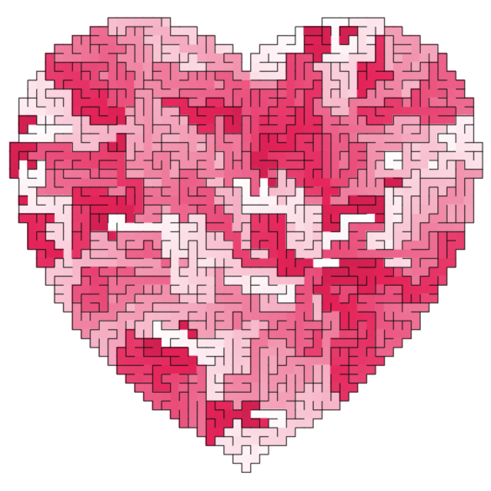

# maze
Currently a trying-to-be-fancy maze generating and rendering tool. Visit [here](https://kaiyingshan.github.io/maze) for a demo.
<table style="border: 0">
    <tr>
        <td></td>
        <td></td>
    </tr>
    <tr>
        <td>Square maze colored with blue.</td>
        <td>Heart-shaped maze colored with pink.</td>
    </tr>
</table>

### Mechanism
#### Maze generation and rendering
Use a random spanning tree to generate the structure of the maze. Render the maze based on the fact that there will not be a wall where there is an edge of the spanning tree.

#### Coloring
Based on depth-first search. The former the square is traversed, the darker the square is. Color reset to original after becoming white. Rate of change of color can be changed in this application.